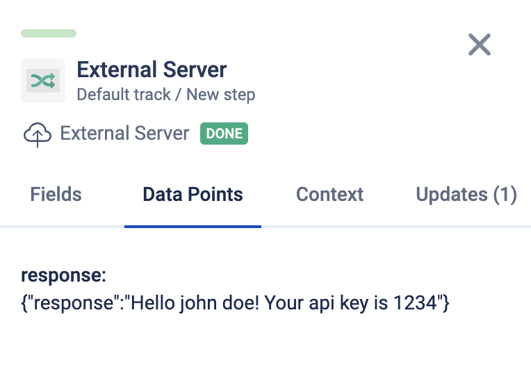

# Prototype Extension

Learn about extensions [here](https://developers.awellhealth.com/awell-extensions/docs/getting-started/what-are-awell-extensions), and visit our [extensions repository](https://github.com/awell-health/awell-extensions) to contribute any extension you create.

## Using this repository

This repository is an exmample of a single extension that you can run from your local machine by configuring the `external-server` extension and routing it to your local server (e.g. via ngrok).

Instructions:

1. Enable the "External Server" extension in studio
2. Start a local ngrok server (e.g. `ngrok http 3000`)
3. Add the URL provided by ngrok to the `url` field in settings
4. Run the `yarn test-server` script in this repository
5. Add the `External Server` action to your care flow
6. extension key: `my-extension`, action key: `my-action`
7. Add `{ "fields": { "name": "<some name>" }, "settings": { "api_key": "<anything>" } }` as the json object
8. Set the datapoint as a string response datapoint
9. Attempt a test case, and see the response in : 
